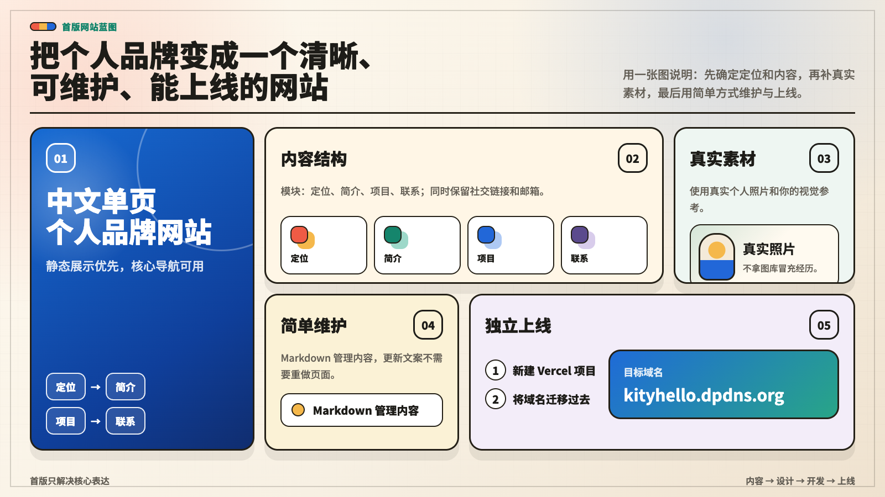

# Gin 个人网站需求文档

## 项目目标

把个人品牌整理成一个清晰、可维护、能独立上线的网站。首版以静态展示为主，优先保证核心导航可用、内容真实、维护方式简单。

## 核心用户动作

- 快速理解 Gin 的个人定位和项目方向。
- 浏览项目展示与详情页，了解项目用途、实现重点和相关链接。
- 通过联系方式继续沟通。
- 从网站悬浮咨询入口打开对话窗口，发送项目、工具或自动化相关问题，并在站内看到等待状态和回复。

## 内容范围

- 首页：个人定位、简介、项目入口和联系方式。
- 项目详情：项目说明、相关链接和项目图片。
- 分享区域：预留书籍、人工智能、效率与生活等分类。
- 联系方式：邮箱、微信、代码仓库和即刻。
- 咨询入口：右下角悬浮按钮、站内对话窗口、消息接口、飞书转接适配层；只有飞书真实接收后才显示发送成功，没有凭证或发送失败时显示真实错误；本地真实发送优先沿用“小明”飞书机器人的私聊会话。

## 维护方式

网站内容优先通过结构化数据和 Markdown 风格的文本维护，减少为了更新内容反复重做页面的成本。新增或修改项目时，主要更新 `app/site-data.ts` 并准备对应图片素材。

咨询入口的真实飞书接入配置记录在 `docs/consultation-feishu.md`。飞书应用凭证、接收会话 ID 和事件校验 token 必须通过环境变量配置，不能写入仓库。

## 补充：首版网站蓝图

这张流程图记录首版搭建时的关键决策：先确定定位和内容，再补充真实素材，最后用简单方式维护与上线。

### 蓝图要点

- 内容结构：定位、简介、项目、联系，同时保留社交链接和邮箱。
- 真实素材：使用真实个人照片和可确认的视觉参考，不拿图库冒充经历。
- 简单维护：用 Markdown 风格内容管理，更新文案不需要重做页面。
- 独立上线：新建 Vercel 项目，并将域名迁移到 `kityhello.dpdns.org`。

## 验收标准

- 首页能清楚表达个人品牌和主要项目入口。
- 项目详情内容与真实项目材料一致，不编造未确认功能。
- 图片素材来自项目截图、代码结构、用户提供材料或其它可确认来源。
- 内容更新路径明确，后续维护不依赖大范围页面改造。
- 咨询入口在桌面和移动端都能打开、输入、发送；无飞书凭证时明确报错且不显示模拟成功消息；本机具备 `lark-cli` 和小明私聊会话配置时，能把咨询消息发到飞书私聊；有飞书 Open API 测试凭证时能向指定飞书会话发送消息，并以飞书实际收到为验收标准。
